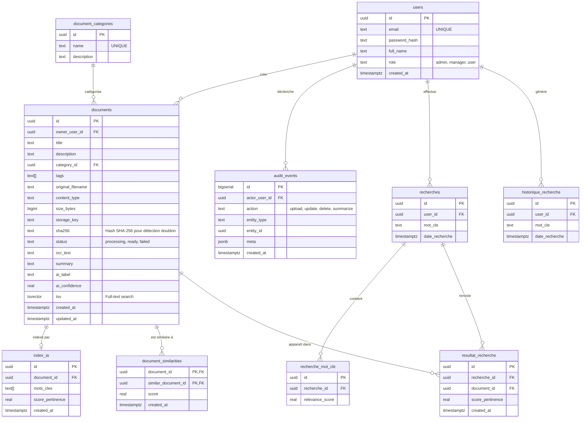

# Cahier des Charges - Plateforme AI de Gestion Documentaire (DMS)

## 1. Présentation du Projet
Le projet **Document Management System (DMS) AI Platform** est un système de gestion électronique de documents intelligent. Il vise à centraliser, stocker, analyser et rechercher efficacement des documents d'entreprise. Grâce à l'intégration d'un microservice d'Intelligence Artificielle dédié, la plateforme est capable d'extraire automatiquement du texte, de réaliser une reconnaissance optique de caractères (OCR) sur des documents non structurés ou scannés, de générer des résumés intelligents, de classifier les documents selon des catégories métiers spécifiques, et de proposer une recherche intelligente basée sur l'analyse sémantique. Ce projet est particulièrement pertinent pour digitaliser des processus métier complexes (par exemple, pour des entités comme Tunisie Telecom).

## 2. Objectifs
- **Dématérialisation et Centralisation :** Unifier la gestion documentaire au sein d'une seule plateforme accessible via le web.
- **Accessibilité de l'Information :** Faciliter la recherche d'informations grâce à une recherche plein texte performante (PostgreSQL Websearch) et une recherche intelligente avec classement par pertinence.
- **Automatisation Intelligente :** Intégrer l'IA pour automatiser le traitement des documents (extraction de contenu, génération de résumés, classification métier, indexation IA).
- **Gestion Complète du Cycle Documentaire :** Permettre l'ajout (avec vérification de doublon), la modification, la suppression (avec confirmation) et la consultation des documents.
- **Ergonomie :** Fournir une interface utilisateur moderne, réactive et intuitive pour la gestion des fichiers (Dashboard, visualisation de données, modales de confirmation/édition).
- **Sécurité et Scalabilité :** Assurer un stockage sécurisé et structuré des métadonnées (en base de données relationnelle) et des fichiers physiques (stockage objet S3), avec une architecture orientée microservices conteneurisée.

## 3. Acteurs et Rôles (Gestion des Accès)
Le système prévoit une gestion des accès basée sur différents rôles utilisateurs.
- **Directeur (Admin)** : Accès complet à la plateforme, supervision globale, accès à toutes les fonctionnalités de gestion (CRUD complet sur documents, catégories, utilisateurs).
- **Manager** : Accès étendu aux documents de son périmètre, possibilité de valider, modifier ou réorganiser les données. Peut gérer les catégories.
- **Utilisateur Standard (User)** : Consultation, recherche et téléversement de documents selon ses droits et habilitations.

## 4. Fonctionnalités Principales

### 4.1. Gestion Documentaire (CRUD Complet)

#### 4.1.1. Ajouter un Document
- **Demander formulaire d'ajout** : Le directeur accède au formulaire de téléversement.
- **Remplir formulaire** : Saisie du titre, description, tags, catégorie et sélection du fichier.
- **Vérifier existence document** : Avant l'insertion, le contrôleur vérifie si un document identique (même SHA-256) existe déjà pour cet utilisateur.
  - **[Test = faux]** : Le document n'existe pas → enregistrement + analyse IA + affichage "Document ajouté avec succès".
  - **[Test = vrai]** : Le document existe déjà → affichage "Erreur : document déjà existant".
- **Formats supportés** : PDF, Microsoft Word (DOCX), texte brut (TXT).
- **Stockage d'objets sécurisé** : Sauvegarde des fichiers physiques via MinIO (compatible API Amazon S3).

#### 4.1.2. Modifier un Document
- **Rechercher Document** : Le directeur recherche et sélectionne le document à modifier.
- **Cliquer sur "Modifier"** : Affichage d'une modale d'édition pré-remplie avec les données actuelles (titre, description, tags, catégorie).
- **Saisir les nouvelles données** : Modification des champs souhaités.
- **Confirmer la Modification** : Envoi des nouvelles données → le contrôleur enregistre les modifications en base.
- **Confirmation de mise à jour** : Affichage "Document modifié avec Succès" + actualisation de la liste.

#### 4.1.3. Supprimer un Document
- **Rechercher Document** : Sélection du document cible.
- **Cliquer sur "Supprimer"** : Affichage d'une fenêtre de confirmation modale.
- **Confirmer la suppression** : Envoi de la demande de suppression (ID_Document) → suppression de l'enregistrement en base et du fichier dans S3.
- **Confirmation de suppression** : Affichage "Document supprimé avec Succès" + actualisation de la liste.

#### 4.1.4. Consulter un Document
- Lecture des métadonnées, du texte extrait, du résumé et de la classification IA.
- Téléchargement du fichier original via une URL signée temporaire (60 secondes).

### 4.2. Traitement par Intelligence Artificielle (AI Service)
- **Extraction de texte native** : Récupération du texte directement depuis les fichiers natifs PDF (via `PyMuPDF`) ou DOCX (via `python-docx`).
- **OCR (Reconnaissance Optique de Caractères) - Fallback** : Si le PDF est une image ou un document scanné, le système active automatiquement un processus OCR (via `pytesseract` et `Pillow`) sur la première page.
- **Résumé automatique intelligent** : Le directeur peut demander un résumé d'un document sélectionné. Le contrôleur récupère le contenu, analyse le texte (extraction des idées clés, génération des mots-clés, génération du résumé), enregistre et affiche le résumé. L'utilisateur peut aussi demander l'enregistrement du résumé.
- **Classification métier hybride** : Catégorisation automatique des documents en trois labels principaux : **Finance**, **RH**, et **Support Client**. Le modèle utilise une approche hybride combinant des règles métiers (mots-clés) et du Machine Learning (`LinearSVC` + `TfidfVectorizer`).
- **Index IA (IndexIA)** : Après l'analyse de chaque document, les mots-clés extraits et leur score de pertinence sont stockés dans la table `index_ia` pour alimenter la recherche intelligente.

### 4.3. Recherche Intelligente
- **Saisir requête de recherche** : Le directeur entre une requête en langage naturel.
- **Analyser la requête (intelligence)** : Le contrôleur de recherche analyse la requête, extrait les mots-clés et comprend l'intention métier (Finance, RH, Support Client).
- **Construire la requête intelligente** : Construction d'une requête FTS optimisée depuis les mots-clés extraits.
- **Effectuer une recherche intelligente** : Exécution sur la table `documents` avec jointure sur `index_ia`.
- **Classer / filtrer les résultats par pertinence** : Les résultats sont triés par `ts_rank_cd` + score IA.
- **[liste non vide]** : Affichage des résultats avec score de pertinence.
- **[liste vide]** : Notification "Aucun document trouvé".
- **Historique des recherches** : Chaque requête est enregistrée dans `historique_recherche` et `recherches`.

### 4.4. Gestion des Catégories
- Interface dédiée pour la création, modification et suppression des catégories de documents.
- Accès réservé aux rôles Admin et Manager.
- Les catégories sont associables aux documents lors de l'ajout ou de la modification.

### 4.5. Tableau de Bord (Dashboard)
- Visualisation de statistiques documentaires : répartition par classification IA (camembert), uploads des 14 derniers jours (courbe), distribution des statuts (barres).
- Accès rapide aux informations utilisateur (nom, email, rôle) et indicateurs clés (total documents, volume, état pipeline).
- Auto-refresh toutes les 10 secondes.

## 5. Architecture Technique
Le projet adopte une architecture moderne, découplée en microservices, et s'exécute dans des conteneurs via **Docker Compose**.

### 5.1. Composants du Système

1. **Frontend (Interface Utilisateur Client)**
   - **Technologies** : React 18, Vite, TypeScript.
   - **Port par défaut** : 5173
   - **Bibliothèques clés** : `react-router-dom` (routage), `axios` (appels API), `@tanstack/react-query` (gestion asynchrone), `recharts` (graphiques dashboard).
   - **Pages** : Login, Dashboard, Documents (avec modales édition/suppression), Catégories.

2. **Backend (Serveur API Principal)**
   - **Technologies** : Node.js (v22), Express, TypeScript.
   - **Port par défaut** : 8080
   - **Routes API** :
     - `POST/GET /api/auth` — authentification JWT
     - `GET/PUT /api/users` — gestion utilisateurs
     - `GET/POST/PUT/DELETE /api/documents` — CRUD documents
     - `POST /api/documents/:id/summarize` — génération et enregistrement du résumé
     - `GET /api/documents/:id/download` — URL signée de téléchargement
     - `POST /api/search` — recherche intelligente avec ranking
     - `GET /api/search/historique` — historique des recherches
     - `GET/POST/PUT/DELETE /api/categories` — gestion des catégories
   - **Bibliothèques clés** : `pg`, `multer`, `@aws-sdk/client-s3`, `jsonwebtoken`, `bcryptjs`, `zod`, `helmet`, `cors`.

3. **AI Service (Microservice d'Intelligence Artificielle)**
   - **Technologies** : Python, Flask.
   - **Port par défaut** : 5000
   - **Endpoints** : `GET /health`, `POST /analyze`
   - **Bibliothèques clés** : `pytesseract`, `Pillow`, `PyMuPDF`, `python-docx`, `scikit-learn`, `numpy`.

4. **Base de Données Relationnelle (DB)**
   - **Technologie** : PostgreSQL 16 (Alpine).
   - **Port par défaut** : 5432
   - **Extensions** : `pg_trgm`, `unaccent`.

5. **Stockage Objet (Storage)**
   - **Technologie** : MinIO.
   - **Ports** : 9000 (API S3), 9001 (Console d'administration).

## 6. Exigences Non Fonctionnelles
- **Déploiement** : `docker compose up --build`.
- **Interopérabilité** : Communication inter-services via API REST sur réseau Docker interne.
- **Sécurité API** :
  - Authentification JWT (JSON Web Tokens).
  - Limitation de taux (`express-rate-limit`) contre DoS/Brute Force.
  - Sécurisation des headers HTTP avec `helmet`.
- **Intégrité des données** : Vérification de doublon par hash SHA-256 avant tout enregistrement.
- **Traçabilité** : Journal d'audit (`audit_events`) pour toutes les actions structurantes (upload, modification, suppression, résumé).

## 7. Perspectives et Évolutions Futures
- **Traitement Asynchrone (Background Queue)** : File d'attente (Redis/BullMQ) pour le traitement de fichiers volumineux.
- **Moteur de Recherche Avancé** : Intégration d'**Elasticsearch** pour des recherches heuristiques et floues.
- **Recommandation Documentaire** : Index de similarité basé sur des embeddings (Transformers) via la table `document_similarities`.
- **Administration Avancée** : Interface UI dédiée pour la gestion fine des utilisateurs et autorisations.
- **Notifications temps réel** : WebSocket pour alerter l'utilisateur de la fin du traitement IA.

## 8. Modèle de Données (Schéma de Base de Données)
La plateforme utilise **PostgreSQL** pour stocker de manière robuste et performante les entités du système.

### 8.1. Diagramme de Classes (Modèle UML)

```
utilisateur                    Document                    Categorie
─────────────────              ───────────────────         ────────────────
-idUtilisateur                 -idDocument                 -idCategorie
-nom                           -titre                      -nomCategorie
-email                         -dateAjout                  -description
-Mot de passe                  -contenu                    ────────────────
-Role                          -taille                     +ajouterCategorie()
─────────────────              -statut                     +ModifierCategorie()
+se connecter()                ───────────────────
+recherche document()          +UPloader()
+telecharger document()        +supprimer()
                               +consulter()

IndexIA                        Recherche                   HistoriqueRecherche
─────────────────              ───────────────────         ────────────────────
-idIndex                       -idRecherche                -idHistorique
-Mots Clés                     -Mot Clé                    -Mot Clé
-Score pertinence              -date recherche             -date Recherche
─────────────────              ───────────────────         ────────────────────
+analyser Document()           +Lancer recherche()         +afficher Historique()
+extraire Mots Clés()

Recherche_MotCle               ResultatRecherche
─────────────────              ───────────────────
-idRecherche_MotCLE            -idResultat
-relevance_score               -Score pertinence
                               ───────────────────
                               +afficher Resultat()
```

**Relations :**
- `utilisateur` (1) —crée→ (0..*) `Document`
- `utilisateur` (1) —effectue→ (0..*) `Recherche`
- `Document` (1) —appatient_a→ (1) `Categorie`
- `Document` (1) —contient_rf_a→ (1) `ResultatRecherche`
- `IndexIA` (1..*) —produit→ (1) `Document`
- `IndexIA` (0..*) —consulte→ (0..*) `HistoriqueRecherche`
- `Recherche_MotCle` (1) —est_associe_a→ (1) `ResultatRecherche`
- `Recherche` (0..*) —renvoie→ (1) `ResultatRecherche`

### 8.2. Schéma de Base de Données (PostgreSQL)



### 8.3. Description des Tables

| Table | Description |
| :--- | :--- |
| **`users`** | Stocke les utilisateurs, leurs informations d'authentification et rôles (`admin`, `manager`, `user`). |
| **`document_categories`** | Référentiel personnalisable des catégories de documents, gérable via l'interface. |
| **`documents`** | Cœur du système. Métadonnées, chemin S3 (`storage_key`), hash SHA-256 (détection doublon), résultats IA (`ocr_text`, `summary`, `ai_label`, `ai_confidence`) et vecteur FTS (`tsv`). |
| **`index_ia`** | Mots-clés extraits et score de pertinence par document, produits lors de l'analyse IA. Alimente la recherche intelligente. |
| **`recherches`** | Enregistrement de chaque requête de recherche lancée par un utilisateur. |
| **`historique_recherche`** | Journal complet des recherches utilisateur, consultable depuis l'API. |
| **`recherche_mot_cle`** | Association entre une recherche et ses mots-clés avec score de pertinence. |
| **`resultat_recherche`** | Documents retournés pour chaque recherche, avec leur score de pertinence calculé. |
| **`document_similarities`** | Scores de similarité inter-documents pour la recommandation documentaire (évolution future). |
| **`audit_events`** | Journal d'audit de toutes les actions structurantes (upload, update, delete, summarize) avec métadonnées JSONB. |

## 9. Diagrammes de Séquence

### 9.1. Ajouter un Document
`Directeur` → `Interface_Documents` → `Contrôleur_Document` → `Document`
1. Demander formulaire d'ajout / Remplir formulaire
2. Envoyer données document
3. Vérifier existence document (SHA-256)
4. Retourner résultat vérification
5. **[Test = faux]** : Enregistrer document → Confirmation → "Document ajouté avec succès"
6. **[Test = vrai]** : "Erreur : document déjà existant"

### 9.2. Modifier un Document
`Directeur` → `Interface Gestion Document` → `Contôleur_Gestion_Document` → `Document`
1. Rechercher Document → Demander Document → Lire Document → Retourner Document
2. Cliquer sur "Modifier" → Demander données actuelles → Données actuelles trouvées
3. Afficher formulaire avec données → Saisir les nouvelles données
4. Confirmer la Modification → Envoyer nouvelles données → Enregistrer les Modifications
5. Confirmation de mise à jour → Message "Document modifié avec Succès"
6. Actualiser et afficher la liste Document

### 9.3. Supprimer un Document
`Directeur` → `Interface Gestion Document` → `Controller_gestion_Document` → `Document`
1. Rechercher Document → Afficher Document
2. Cliquer sur "supprimer" → Afficher fenêtre de confirmation
3. Confirmer la suppression → Envoyer demande de suppression (ID_Document)
4. Supprimer l'enregistrement → Confirmation de suppression
5. Message "Document supprimé avec Succès" → Actualiser et afficher la liste Document

### 9.4. Recherche Intelligente
`Directeur` → `interface de recherche` → `contrôleur de recherche` → `document`
1. Saisir requête de recherche → envoyer la requête
2. analyser la requête (intelligence)
3. extraire les mots-clés et comprendre l'intention
4. construire la requête intelligente → effectuer une recherche intelligente
5. **[liste non vide]** : retourner les résultats → classer/filtrer par pertinence → afficher résultats
6. **[liste vide]** : envoyer notification "aucun document trouvé" → afficher résultat

### 9.5. Résumer un Document
`Directeur` → `interface de résumer` → `contrôleur` → `document`
1. Sélectionner un document → demander résumer
2. envoyer la demande → récupérer le contenu du document
3. analyser le contenu → extraire les idées clés → générer les mots-clés → générer le résumé intelligent
4. retourner résumé → afficher le résumé
5. demande d'enregistrer le résumé → enregistrer le résumé → afficher message de succès
